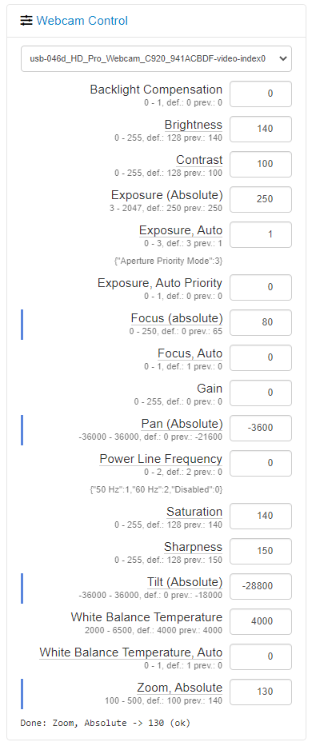

# Dev Helper

Change webcamera parameters instantly from the sidebar.

## Motivation

Wanted a quick and easy solution to adjust my webcam focus/exposure/tilt.
MJPG Streamer has similar interface, but I was not satisfied with the quality and bandwidth usage,
I [switched to H264 codec](octoprint_webcam_control/static/html/), so it's no longer an option.

## Setup

`sudo apt install v4l-utils`

Install via the bundled [Plugin Manager](https://plugins.octoprint.org/)
or manually using this URL:

    https://github.com/clonesht/OctoPrint-WebcamControl/archive/main.zip
